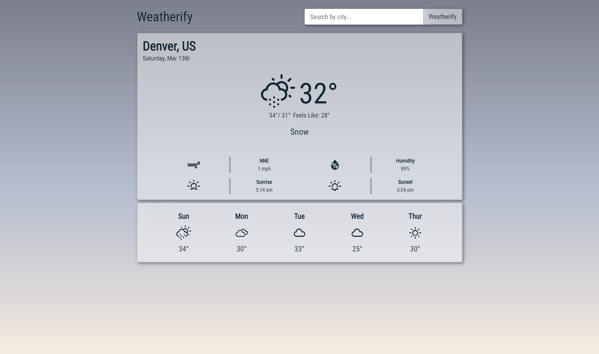

# :sunny: Weatherify - OpenWeather API

[Weatherify](https://weather-app-teal.now.sh/) is an ongoing and iterative project that allows users to check the current daily and weekly forecast by city. The [OpenWeather](https://openweathermap.org/) API is being used to display various weather data while all icons are provided by the [Weather Icons](http://erikflowers.github.io/weather-icons/) library.

This project was bootstrapped with Create React App.
 

## :clipboard: Features

### :package: Current

- [x] Users can search for the weather by city to display the current and five-day weather for said city.
- [x] Weather Icons will display either the day-time or night-time icons based off the cities current timezone and time of day.
- [x] The background and application header changes dynamically based on the cities current timezone and time of day.

### :crystal_ball: Future

- [ ] Find the user initial location using geo-location.
- [ ] Add ability for users to type in any address that is than turned into Lat/Long coordinates that the API can use to find the correct correction. This is so if two cities (i.e Rome :earth_africa:) in multiple states and/or country share the same name, the application can find the correct one.
- [ ] Add Autocomplete feature to search.
- [ ] Add ability to change between Fahrenheit and Celsius.
- [ ] Add to or change backgrounds to something more visually interesting and appealing.
- [ ] Add animation to simulate different weather effects such as rain, snow, cloud movement, etc.
- [ ] Add Language Feature.
- [ ] Make code DRY
- [ ] Add error handling for user feedback.
